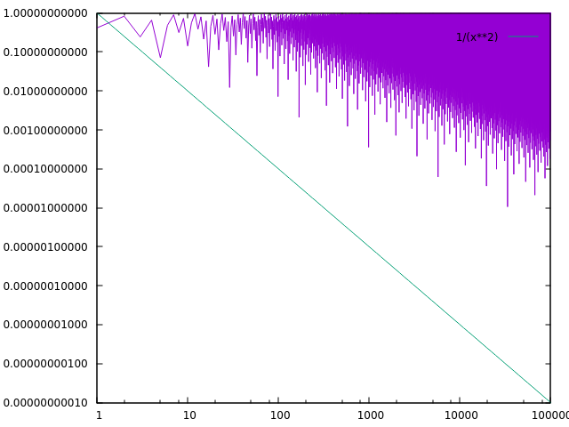
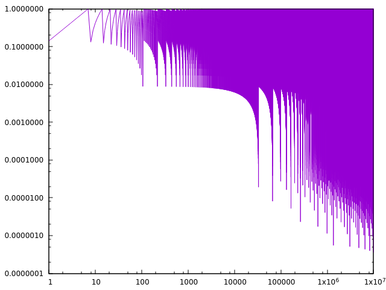

$K>0$ is the irrationality measure for $\alpha$ (1):

$$
0 < |\alpha - \frac{p}{q}| \le \frac{1}{q^K}
$$

$|\{ (p,q) : p,q \in \mathbb{Z}\}|<\infty$ 

$M\subset\mathbb{Z}\times\mathbb{Z}$, where M is the set of pairs $p$,$q$ that satisfy (1), if $M$ is finite then the infimum of all such $K$ is called the irrationality measure $\mu$

Alternative form:

$$
\exists C(\alpha) < \infty, \forall p,q > 0, \\
| \alpha - \frac{p}{q} | > \frac{C(\alpha)}{q^n}
$$

Goal

- Figure out irrationality measure

```python=
#!/usr/bin/python3
import gmpy2
with gmpy2.local_context(gmpy2.context(), precision=100) as ctx:
  x = gmpy2.sqrt(2)
  for q in range(1,10000):
    r = q*x - gmpy2.floor(q*x)
    print(q, r)
```




```python=
#!/usr/bin/python3
import gmpy2
with gmpy2.local_context(gmpy2.context(), precision=1000) as ctx:
  x = gmpy2.atan(1)*4 #pi
  for q in range(1,10000000):
    r = q*x - gmpy2.floor(q*x)
    print(q, r)
```




From IRC
> https://planetmath.org/DirichletsApproximationTheorem

This theorem is a bit confusing to understand so I'll reproduce it here:

For any real number $r$ and any integer $n \geq 1$ there exists $a,b\in\mathbb{Z}$ s.t. $1\leq \leq n$ and $|ar-b| \leq \frac{1}{n+1}$.

Proof:

We assume $n\geq 2$ now we can define a function $f(a) = r*a mod 1$ where $f : \left\{1,..,n\right\}\rightarrow S$.

Now if $f(x)=f(y)$ for some $x<y$ then $f(y-x)=0$, so we can assume that f is injective into $\left\[0;1\right)$ and then use the pigenholing principle for $S\cup\left\{0,1\right\} over the intervals of length $\frac{1}{n+1}$ so some two points must be in the same interval, obviously it can't be $0$ and $1$ so one of the points must be from $S$.

If $x\in S$ landed in the same interval as 1 then we use the absolute value to move it next to 0 (increment $b$ compared to how we defined it implicitly when we defined $f$).
If it landed in the same interval as 0 then we are done.
If $x,y\in S$ landed in the same interval then we can again apply the argument we used to assume injectivity to obtain the result.


